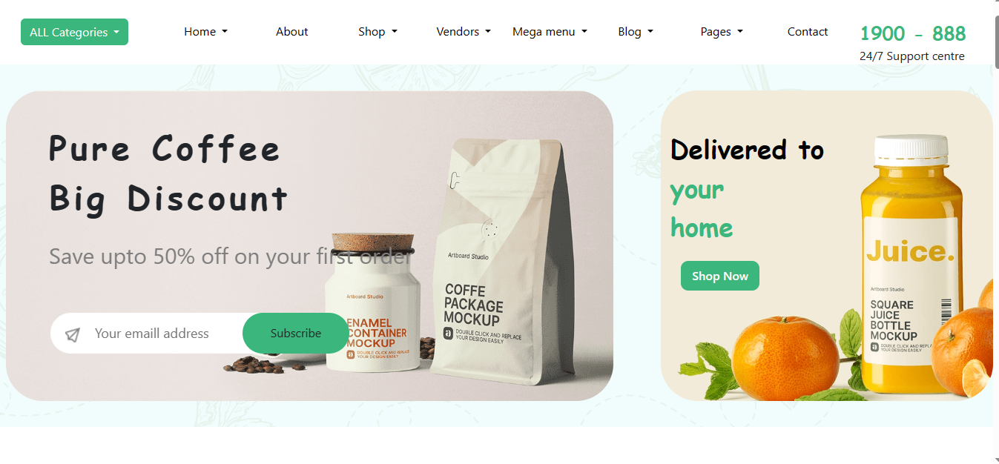

## E-commerce Website

## Overview

This is a simple e-commerce website template built using HTML and CSS. It provides a foundation for creating your own online store or practicing front-end web development skills.

## Features

1.Display of products with images, descriptions, and prices.

2.Basic layout and styling for product listing and individual product pages.

3.Responsive design to ensure compatibility across various devices.

## How to Use
1.Clone this repository to your local machine.

2.Open the index.html file in your web browser.

3.Explore the website to view the product listing and individual product pages.

4.Customize the website by modifying HTML and CSS files to add your own products or change the layout and styling.

## Structure

`index.html`: Main HTML file containing the structure of the website and product listing.

`style.css`: CSS stylesheet for styling the website.

`images/`: Directory for storing product images.

## Customization

Feel free to customize the website by:

1.Adding more products to the index.html file.

2.Modifying the CSS styles in styles.css to change the appearance of the website.

3.Incorporating additional features or functionality using HTML and CSS.

## Technologies Used

**HTML:**  It provides the structure and content of web pages.

**CSS:** Used for styling the web page and making it responsive.

## Credits
This website template was created by **Saravanarajan**.
